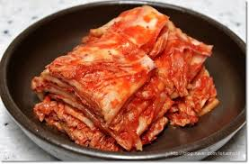
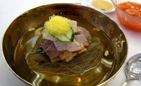
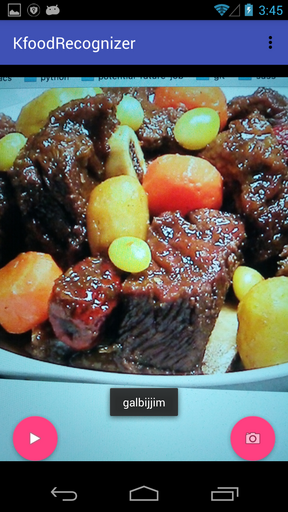

---
title:  Recognizing Korean Food in Photos through Transfer Learning of Deep Features

date: March 12, 2016

author: Joseph Kim

bibliography: references.bib

geometry: left=1in,right=1in,top=1in,bottom=1in

csl: ieee-with-url.csl
...

# Introduction

Food is one of the most common things that people take photos of these days. Google recently reported that food photos were the second most common kinds of photos uploaded by Google Photos users [@GoogleBlog:Photos]. Given that there is so much food photos data, as well as the fact that there are so many food-based startups these days, applying image recognition on photos of food has lots of potential for interesting applications, such as recommender systems. A quick google search shows that there are a few academic food recognition projects and papers, but none specifically for Korean foods.

The primary goal of this project was to create a Korean food recognizer that can identify Korean foods in photos. Specifically, the goal was to create a supervised machine learning model trained on images of Korean foods that takes a new image as input, and accurately output the name of the dish in the photo. Because of the success of deep convolutional neural networks (CNN) for image recognition in recent years, a good candidate model would be a CNN that is trained on Korean food photos.

Because training all the weights in every layer of a CNN from scratch requires a lot of images and a lot of computational power, transfer learning can be used to reduce both the CPU workload as well as the size of the dataset. By applying transfer learning on a CNN already trained to recognized images, all that is left is to retrain the top layer of a pre-trained CNN to recognize Korean food in photos. Google's Inception-v3 CNN was a very easy choice for a pre-trained network, which had been trained on ILSVRC2014 dataset to perform very well on the ImageNet Large Visual Recognition Challenge. At the time of this writing, it outperforms all the other models for the ImageNet dataset [@SzegedyVISW15]. The ILSVRC dataset contains 1.2 million images from 1000 categories [@ILSVRC15], which means that Inception v3 was a good choice for a generic image recognition tool that I can fine-tune for this problem.

The Inception v3 convolutional network in its current form is able to read in a digital image and output one of the 1000 labels. Because Inception v3 is a type of neural network, it has hidden layers, or stages containing mathematical processes, through which the image data is propagated in order to determine the label. The last stage reads in a numerical vector of size 2048 and outputs the label of the image. This numerical vector, or **deep features** of an image, are numerical representations of the images that have gone through all the hidden layers prior to that point in the neural network, such that they are optimized for the final layer of the model to determine what the image represents. Transfer learning works because those features can be used to train different "last layers", or other machine learning algorithms, such as support vector classifiers and logistic regression models. In order to set a benchmark performance, these other machine learning algorithms were trained on these deep features. In addition, another CNN implemented by a private company, MetaMind, was used for comparison.

The secondary goal of this project was to create a proof of concept prototype that can demonstrate a typical use case for this technology. Many machine learning projects come to completion where the end results consist of metrics and charts, with no real products. This is understandable due to the nature of how the projects are evaluated. However, with this project, there was an opportunity to develop software that can actually utilize the end results of the machine learning process for a tool closer to an actual product that people can use. Because "Foodies" these days take photos using their mobile devices, I wanted to show how food identification can work on a mobile device. This resulted in two other GitHub projects, kfood-server [@KfoodServer] and kfood-android [@KfoodAndroid].

## Metrics

This problem is a supervised multi-class classification problem, where the class labels are the names of the various Korean foods and dishes. Though this problem can be formulated as a regression problem using probabilities each food label, classification was chosen because the end model will only be used in the mobile app to to output a simple label given an image of Korean food, not the probabilities. Therefore the performance of the models were primarily measured by *accuracy* on the test data, as defined by the following formula:

$$accuracy = \frac{\#\ correct\ predictions}{\#\ total\ predictions}$$

This can also be written as the following:

$$accuracy = \frac{ TP + TN }{TP + FP + FN + TN}$$
$TP$ is true positives, $TN$ is true negatives, $FP$ is false positives, and $TN$ is true negatives.

For training the last layer of the deep convolutional network, the objective loss function is *cross entropy* (also known as *log loss*). Cross entropy is a way to measure the error in a predictive model based on how close the model predictions on training data points are to the true labels. It has nice numeric properties such that minimizing it enables the model optimizer to find optimal parameters. It is defined as:
$$log loss = -\frac{1}{N}\sum_{i=1}^N\sum_{j=1}^Ky_{ij}\log(p_{ij})$$
$N$ is the number of training samples, $K$ is the number of classes, which is the number of Korean food dishes in this project, $y_{ij}$ is the correct binary value (1 if it is that label, 0 otherwise) for the $jth$ label for sample $i$, and $p_{ij}$ is the predicted probability of sample $i$ for the $jth$ label.

Fine-tuning support vector classifier and logistic regression models using cross-validated grid-search also used *cross entropy*.

*F1 score* was also considered for analysis, but because the distribution of training data across each of the labels was not overly skewed (See Figure \ref{figure_data_distrib}), *accuracy* was good enough to gauge performance for this multi-classification problem.

# Analysis

## Data

### Acquiring and Filtering
20 Korean dishes were selected based on how common and popular they are among Korean and Korean Americans.
For each of the dishes, 150-300 images were downloaded from the web using Google image search, for a total of around 5,000 images.
Then each of the images were manually viewed, and filtered out if the images were low quality or deemed non-representative of the actual dish.
After the filtering process, the dataset consisted of 3,470 images, with max, mean and min of 219, 173.5 and 112 images per label, respectively.

### Deep Features Transformation

Each image file was transformed to deep features, which are numeric embedding vectors of size 2048, using a modified version of the `classify_image.py` script provided by Google in the TensorFlow source code and saved to disk for further analysis. These embeddings are the numeric vector representations of the inputted training images generated by the second last layer of the Inception-v3 network. For example, a photo of kimchi, a Korean side dish made of cabbage and red pepper power (and many other ingredients that I am unfortunately unaware of, see Figure \ref{figure_kimchi}) is represented by the vector `[0.396441, 0.102777, 0.625034, 0.0800543, ...]`. A photo of nangmyun, which are noodles immersed in iced beef broth often served with egg and beef briskets (see Figure \ref{figure_nangmyun}), is represented by the vector `[0.253132, 0.551145, 0.469389, 0.108731, ...]`. The examples here show only the first 4 elements, but the values at every 2048 positions of the vectors are used by the machine learning models to distinguish between all the category labels.

Table \ref{table_deep_features} shows that the values of the deep features were similar to each other in terms of range, and there were no concerns about certain features dominating other features with values that were much bigger. In other words, standardizing columns was not a terribly big concern.

|       |  feature0	    |  feature1	    |  feature2	    | feature3	   | feature4   |
|-------|---------------|---------------|---------------|--------------|------------|
|count	|  3470         |  3470       	|  3470       	| 3470      	 | 3470       |
|mean	  |  0.292122	    |  0.409072	    |  0.527338	    | 0.205257	   | 0.341956   |
|std	  |  0.210247	    |  0.310620	    |  0.348090	    | 0.196429	   | 0.309863   |
|min	  |  0.002776	    |  0.000000	    |  0.009342	    | 0.000000	   | 0.000000   |
|25%	  |  0.135991	    |  0.177316	    |  0.271595	    | 0.066020	   | 0.121058   |
|50%	  |  0.244641	    |  0.341317	    |  0.450077	    | 0.147333	   | 0.259115   |
|75%	  |  0.396790	    |  0.555601	    |  0.708050	    | 0.281080	   | 0.469292   |
|max	  |  1.751740	    |  2.421970	    |  2.682040	    | 1.811220	   | 3.519750   |

Table: Description of First Five Deep Features \label{table_deep_features}

### Train-Test Split

The dataset was then split into separate train and test sets with the training set consisting of 70% (2431 samples) of the data, and the test set 30% (1039 samples). The splits were stratified with respect to the labels, so that the representation of the labels after the split remain similar to the dataset before the split (See Table \ref{table_train_test_split}).

\newpage

|               | train | test | % test   
|---------------|-------|------|----------
|    bibimbab   |  150  |  64  | 29.9     
|     bossam    |  121  |  52  | 30.0     
|    bulgogi    |  128  |  55  | 30.0     
| dakbokeumtang |  120  |  51  | 29.8     
|    dakgalbi   |  144  |  61  | 29.7     
|   ddukbokee   |  105  |  45  | 30       
|   galbijjim   |  153  |  66  | 30.1     
|    hotteok    |  147  |  63  | 30       
|    japchae    |  135  |  58  | 30.0     
|      jeon     |   94  |  40  | 29.8     
| jeyookbokkeum |  116  |  49  | 29.6     
|     kimbab    |  152  |  65  | 29.9     
|     kimchi    |   89  |  38  | 29.9     
|    lagalbi    |  104  |  44  | 29.7     
|    nangmyun   |  145  |  62  | 29.9     
|     ramen     |   83  |  35  | 29.6     
|   samgyetang  |  111  |  47  | 29.7     
|   samgyupsal  |  121  |  52  | 30.0     
|  sullungtang  |  135  |  58  | 30.0     
|  yookgyejang  |   78  |  34  | 30.3     

Table: Stratified Train-Test Split \label{table_train_test_split}

\newpage

## Algorithms

### Transfer Learning

The Inception-v3 network was used to generate 2048 deep features, and the top fully-connected layer of the network was retrained, which applies the Softmax function to output probability values for each of the Korean food labels.

Transfer learning in machine learning is the application of knowledge learned in one problem to another similar or related problem, and has been around for at least a couple of decades [@wiki:transfer]. A relatively recent discovery of transfer learning through trained deep neural networks has raised a lot of excitement and opened doors to a lot of applications. Researchers found that the trained weights of nodes in a trained network, particularly the lower and mid-level nodes, can be copied readily to other deep networks, along with the structure of the deep network, and just retraining the high-level classification layer can result in a network that performs very well for a new problem. For example, for image recognition, taking a convolutional neural network that performs very well on recognizing various types of images and retraining the classification layer to identify a specific set of labels such as dog breeds or food types can work well. That's because the lower nodes and layers of the CNN learn low-level features of the images, which are necessary for many image recognition tasks, but the higher nodes and layers learn high-level features, which tend to be more specific to the dataset [@YosinskiCBL14].

A big advantage of transfer learning is that we can drastically reduce the total amount of computations needed to train deep networks. Successful deep learning projects are often trained on high performance clusters and servers with GPUS to reduce the time to compute all the vectorized matrix operations, and runtimes can be hours, days and even weeks. With only a personal laptop, an engineer can take one of these trained networks, and just retrain the last layer of the network on a smaller set of data for a specific classification task without performance or memory issues.

A disadvantage of transfer learning is that the resulting classifier model may not be able to outperform a CNN whose entire set of weights are retrained at all levels for the specific problem, not just the upper layers. A good way to leverage a trained CNN would be to take the weights and use them as initial values, but keep them variable so that the model can be fine-tuned for the specific problem. As long as there is enough good-quality training data that won't cause the new CNN to overfit to the training set, retraining the entire network may be a better idea if the computing resources are available.

### Benchmark

Preliminary benchmarks were set using six different kinds of machine learning classifier algorithms using the scikit-learn Python library (with varying parameters), and one online deep learning service provided by DeepMind through a programmable API. 3 highest performing algorithms were fine-tuned to set a practical benchmark. The initial performances of the benchmark algorithms are described in Table \ref{table_preliminary_benchmark}.

|                                Algorithm   | Train Accuracy  | Test Accuracy  
|--------------------------------------------|-----------------|----------------
|          **SVC linear kernel, one-vs-one** |       1.000     |  **0.795**  
|    SVC polynomial deg 2 kernel, one-vs-one |       0.266     |      0.271  
|    SVC polynomial deg 3 kernel, one-vs-one |       0.063     |      0.064  
|                 SVC rbf kernel, one-vs-one |       0.763     |      0.704  
|             SVC linear kernel, one-vs-rest |       1.000     |      0.769  
|  SVC linear poly deg 2 kernel, one-vs-rest |       0.839     |      0.721  
|  SVC linear poly deg 3 kernel, one-vs-rest |       0.868     |      0.726  
|                SVC rbf kernel, one-vs-rest |       0.830     |      0.730  
|                    KNeighbors, 3 neighbors |       0.815     |      0.619  
|                RandomForest, 10 estimators |       0.996     |      0.457  
|                 **LogisticRegression ovr** |       1.000     |  **0.793**  
|         **LogisticRegression multinomial** |       1.000     |  **0.803**  
|                               MetaMind API |       0.790     |      0.770

Table: Preliminary Benchmarks \label{table_preliminary_benchmark}

The 3 highest preforming algorithms from Table \ref{table_preliminary_benchmark} that were selected for fine-tuning were SVC (Support Vector Classifier) with a linear kernel, Logistic Regression using multiple one-vs-rest classifiers, and Logistic Regression using a single multinomial model.

After fine-tuning the parameters of the three models using cross-validated grid search, the performance of the models on the test set improved marginally.

| Algorithm                      | Preliminary | After Fine-tuning
| -------------------------------|-------------|------------------
| SVC                            | 0.794       | 0.797
| LogisticRegression ovr         | 0.793       | 0.797
| LogisticRegression multinomial | 0.804       | 0.806

Table: Fine-Tuned Model Accuracy On Test Data \label{table_fine_tuned}

# Methods

## Implementation

The data analysis and machine learning algorithms were run on a Jupyter Notebook running Python 2.7. The benchmark algorithms with the exception of the MetaMind deep learning API were run using the Scikit-learn library, and TensorFlow was used for running deep learning algorithms on my local machine (15' Macbook Pro 2.3 GHz i7 with 16GB RAM).

MetaMind, a private startup specializing in deep learning services, provides limited free services image classification. Their API allows users to upload test datasets to train a small dataset for transfer learning on a convolutional neural network, and then submit data to get predictions. With the train-test split data, I trained a classifier and ran test predictions to measure the performance of the service.

For generating the deep features, running TensorFlow's `classify_image.py`, based on the TensorFlow documentation [@TF:Recognition] did not work for me out of the box. My initial TensorFlow installation was version 6.0, but the tutorial made use of a library that was not implemented at the time. However, upgrading to a newer version 7.0 caused another error. I was able to find an easy fix by staying with version 6.0, and modifying `classify_image.py`. The details are outlined in this [StackOverflow post](http://stackoverflow.com/questions/35402749/while-running-tensorflows-classify-image-getting-attributeerror-module-obje/35445083#35445083), where my answer is marked as the solution.

The transfer learning model was implemented with TensorFlow's python library. During the course of the project, I learned that the TensorFlow team provided a tutorial on retraining the Inception-v3 network's final layer for custom categories and images [@TF:Retrain], so I was able to use that tutorial and the tutorial's python script `retrain.py` provided in the TensorFlow source code for this project.

The initial model was trained with the default parameters to the `retrain.py` script, except for the `testing_percentage` and `validation_percentage` parameters, which are each 10 by default (these parameters are discussed more in detail in the [Refinement section](#refinement)). Table \ref{table_initial_retrain} shows the initial transfer model's hyperparameters. The intial model's training accuracy was 0.92, and the test accuracy was 0.768.

hyperparameter        | value
----------------------|---------------
training_steps        | 4000
learning_rate         | 0.01
testing_percentage    | 20
validation_percentage | 20
train_batch_size      | 100

Table: Initial Transfer Learning Model \label{table_initial_retrain}

TensorFlow's default installation guides do not provide a way to install TensorFlow on OSX with CUDA support. Because my laptop has a discrete Nvidia graphics card, I wanted to see how much performance improvements I would get if I compiled TensorFlow on my laptop with CUDA support. After compiling TensorFlow on my laptop using a step-by-step guideline I found online [@TF:CUDA] and modifying `retrain.py` to use GPU for some of the matrix operations, I measured the time it took to train using the hyperparameters. Unfortunately, I did not get any speedups. In fact, the version compiled with CUDA ran slightly longer. In the end, I reverted to the default version 6.0 installation.

|Training steps | Default Install | Compiled w CUDA
|---------------|-----------------|----------------
|2000           | 2m18.055s       | 2m30.295s
|1000           | 1m11.341s       | 1m19.523s

Table: Performance Comparison of TensorFlow w GPU \label{table_gpu}

For the mobile application, I tried following the tutorial provided by TensorFlow[@TF:Android], but I wasn't able to get my Android device to run the TensorFlow Demo app. I think this was due to the fact that my device is fairly old (bought over 3 years ago). Therefore, the next best thing was to create a RESTFul web server running TensorFlow so that mobile devices can send photos to the server, and the server can send back the classification label. This way is actually more scalable and better since most devices, even really old ones, have cameras and networking capabilities. Not only that, iOS devices can take advantage of a service like this as well.

The web server was built using Django running on Python 3.4. Additional Python packages include TensorFlow 6.0 and the Django REST Framework, whose usage I had to modify to provide API endpoints serving non-database model objects. The server is actually up an running on Heroku's free sandbox Dyno. A simple HTML interface is available at https://kfood.herokuapp.com/photos and a web service API is accessible at https://kfood.herokuapp.com/api/classify.

The android app was developed using Android Studio by IntelliJ using Android SDK 24.4.1 for devices running at least API level 15.

## Refinement

Refining the TensorFlow model is a process of searching for the set of hyperparameters that would result in the highest test accuracy. The `retrain.py` script provides ways to do this with hyperparameters that can be inputted as arguments to the script. The following hyperparameters are available: training steps, learning rate, train batch size, validation percentage, testing percentage.

The number of training steps is a parameter used for stochastic gradient descent, where the loss function (in this project, cross entropy) is minimized by incrementally changing the weights of the model in the direction computed with a subset of the training data (the **training batch**), as opposed to regular gradient descent, which uses the entire training dataset. By using the smaller subset, the model weights are optimized little by little while still generally headed towards the optimal values, but the time it takes to do the computation of the optimal direction of change is greatly decreased. The training steps hyperparameter basically determines how many times this happens, and though it may sounds like the more steps you take, the more optimal the model weights will get, this is generally not true (as shown by Table \ref{table_hyperparam}, where 10000 training steps didn't improve the model) since the sampled training batches can cause the model to "wander" off the optimal model weights. The best way to use the training steps hyperparameter is to do a series of training runs, and look for the number of steps that will have the best accuracy. Figure \ref{figure_train_acc}, \ref{figure_valid_acc} and \ref{figure_cross_ent} show how the model improves over the training steps with respect to various metrics. The increasing accuracies, especially the validation accuracy, indicate that the model is improving as the time steps increase. It would be a bad sign if the validation accuracy suddenly started decreasing at a certain time point, which would be an indicator that the training step hyperparameter value is too high.

**Learning rate** is also a hyperparameter used in stochastic gradient descent, and it is a constant multiplied to the values that the model weights will change by. High learning rate values may negatively affect the optimization process because the delta values that are added to the model weights at each training step may skip over the optimal weight values, and therefore result in repeated overshoots that run for a very long time. Learning rates that are too small will negatively affect the training process by taking too many iterations to reach the optimal weight values, so the model may never learn the best parameters.

**Training batch** size is the number of training data points that are randomly selected at each learning step of stochastic gradient descent. High training batch size may result in longer computations per training step, but low training batch size may result in taking too long to reach the optimal weight values.

**Validation percentage** is the size of the total data that is used to measure the accuracy of the model. A subset of the validation set is sampled at a set time step to run the most updated model and measure its performance. It provides a quick general idea of how good the model is without having to measure the performance of the entire test set. In the fine-tuning process, the validation set was set at only 5% because the performance of the validation set doesn't really affect how the model is fine-tuned. I wanted to use 70% of the data for training, while keeping the test set at near 30% as I had done with the benchmarking algorithms.

**Testing percentage** is the size of the total data that is used to test the model, especially at the end of the entire training run. This is the best measure of how well a model generalizes to new data, and is therefore the metric used to measure how "good" a model is.
Because I allocated 5% of the data to validation percentage, I kept the testing percentage at 25% so that the training data will remain at 70% of the entire food image dataset.

The script also provides ways to distort the input image files in order to increase the effective size of the dataset, such as random horizontal flipping of the images, random cropping, random scaling and randomly changing the brightness of the images. However, these require image manipulations that are very intense, and when I tried enabling these parameters, I was never able to finish processing a single run of the `retrain.py` script. The process ran for several hours, and my laptop began to heat up, so I stopped it.

Because `retrain.py` randomly selects validation and test subsets for each run, I fixed the validation percentage to 5% and testing percentage to 25%. This was in order to keep it similar to the way the benchmark algorithms were evaluated, where the test data consisted of 30% of the entire data set. Then, I tried various combinations of the number of training steps, learning rate, and train batch size to find the set of hyperparameters that would result in the highest test accuracy.

Table \ref{table_hyperparam} shows some examples of the runs to search for the optimal set of hyperparameters.

train steps    | learn rate    | train batch      | train acc %      | valid acc %      | test acc %      | runtime
---------------|---------------|------------------|------------------|------------------|-----------------|------------
5000           | 0.01          | 200              | 92.5             | 74.0             | 77.4            | 10m26.148s
5000           | 0.01          | 175              | 92.6             | 74.0             | 80.2            | 8m51.950s
5500           | 0.01          | 175              | 95.4             | 74.0             | 76.0            | 10m28.258s
5800           | 0.01          | 175              | 90.9             | 68.0             | 80.2            | 11m7.562s
5900           | 0.01          | 175              | 94.9             | 76.0             | 79.0            | 10m36.280s
6000           | 0.01          | 175              | 94.3             | 69.0             | 81.4            | 11m11.572sp
6100           | 0.01          | 175              | 93.7             | 73.0             | 77.4            | 12m26.308s
6500           | 0.01          | 175              | 95.4             | 75.0             | 75.6            | 12m32.043s
7000           | 0.01          | 175              | 96.6             | 76.0             | 79.2            | 13m23.146s
5000           | 0.01          | 150              | 95.3             | 80.0             | 77.8            | 7m46.747s
5000           | 0.01          | 125              | 98.4             | 77.0             | 78.2            | 6m35.836s
5000           | 0.01          | 100              | 96.0             | 67.0             | 81.2            | 5m25.950s
5400           | 0.01          | 100              | 92.0             | 73.0             | 78.4            | 6m27.017s
5450           | 0.01          | 100              | 91.0             | 67.0             | 79.0            | 6m27.963s
5500           | 0.01          | 100              | 93.0             | 78.0             | 82.0            | 6m45.637s
5500           | 0.01          | 120              | 96.7             | 78.0             | **82.4**        | 7m35.594s
5550           | 0.01          | 100              | 95.0             | 80.0             | 80.6            | 6m37.738s
5600           | 0.01          | 100              | 95.0             | 73.0             | 80.2            | 6m52.054s
6000           | 0.01          | 100              | 96.0             | 78.0             | 78.8            | 6m33.281s
7000           | 0.01          | 100              | 96.0             | 72.0             | 79.6            | 7m39.502s
8000           | 0.01          | 100              | 97.0             | 78.0             | 79.8            | 8m39.124s
10000          | 0.01          | 100              | 97.0             | 71.0             | 78.6            | 10m49.417s

Table: Hyperparemeter Search \label{table_hyperparam}

 

# Results

The final retrained TensorFlow model had a test accuracy of 82.4%, which is a little bit better than the benchmarks, whose accuracies were around 80%. It performed better than the MetaMind model, which had accuracy of 77%. In general, most of the TensorFlow runs resulted in very similar ranges of around 80%, and small perturbations in the hyperparameters doesn't affect the model performance greatly. The best hyperparameters are shown in table \ref{table_hyperparam_optimal}.

hyperparameter      | value
--------------------|---------------
training_steps      | 5500
learning_rate       | 0.01
train_batch_size    | 120

Table: Optimal Hyperparemeters \label{table_hyperparam_optimal}

Figure \ref{figure_cm} shows a confusion matrix of the predictions run on the test set. Here we can see that similar foods are mis-labeled. For example, sullungtang and samgyetang are two kinds of soups that are white-ish in color, and the retrained model tends to misclassify one for the other. This kind of mistake can actually be made by humans also.

")

")

The resulting tensorflow model was saved to disk in a protocol buffer format, which is loaded by the web server.

The android device takes photos, sends it to the web server, and receive the classification label for the food image. Figure \ref{figure_android} shows the screenshot when the device receives back the classification label from the server.

\newpage

# Discussion

## Reflection

The main objectives of this project, which were to train a machine learning model to recognize Korean food, and to develop working prototypes of the resulting model by a mobile application, were both successfully met. The process began with acquiring a dataset by downloading images from the Internet, painfully filtering the dataset through a manual process. Then the deep features of the images were generated by modifying a script provided in the TensorFlow source code, which were then used as inputs to machine learning libraries implemented in scikit-learn for benchmarking. Then initial and fine-tuned transfer learning models were trained using the state-of-the-art image recognition model Inception-v3. Lastly, a web application and a mobile application were developed using the trained model to have an actual working prototype.

This entire end-to-end process was very interesting and fun, as I'd never been involved in every step of the pipeline in a single project before. Most other machine learning projects that I'd been involved in generally provide the datasets, or the process of acquiring the dataset are simple enough, such as parsing some files using some bash commands or a quick perl/python script. Also, these other projects didn't involve the last step, the actual application of the model to a real-world project.

The most interesting thing that I learned during this project is learning about deep learning. I was almost done with the Machine Learning Nanodegree when the TensorFlow course came out on Udacity. So I began the course, and when I had gone 80% through, I got stuck on some theoretical concepts. While googling for solutions, I came across CS224d, a Stanford course on deep learning for natural language processing taught by Dr. Richard Socher, CEO of MetaMind. I watched 8 lectures (twice each) to get a firmer theoretical background. Though I am by no means an expert, I think I have a much firmer grasp on the topic, and I think I can meaningfully use libraries like TensorFlow, Caffe and Torch.

## Improvements

The results of 82.4% accuracy on the test set is pretty good given that there wasn't a lot of training data and that only a single layer was trained. I think that the performance can be improved greatly if instead of just retraining the last layer, the entire network is retrained, with the Inception-v3 weights as initial values.

Having more data would also increase the performance by a few percentage points. This can be done by finding more photos online and curating them for the training process. Another way would be to modify the current dataset by doing some image processing, such as cropping, blurring, changing the image resolution, and so on, such that the actual numerical pixel data changes, but the image is still recognizable to the human eye.

More computationally intensive ways to improve the model would be to add more layers to the convolutional network, rather than just training a single top layer. This kind of exploration would require more computing resources than a personal laptop.

## Real World Applications

Image recognition can and is already being used for a variety of real-world applications. Transfer learning deep convolutional networks, opens doors to even more applications that can be developed quickly. Possible applications include food recommender systems based on images for food apps where searches on images can be run on a database of images or image embeddings to search for restaurants that have the food that the user wants.

Figure \ref{figure_tsne} shows that the image embeddings are spatially clustered in coordinate space, meaning that the deep feature embeddings can be used for identifying similar images and filtering, such as an app that can help find lost dogs where users can upload photos of stray dogs and it can be matched with a database of lost dogs. The spectrum of areas that can apply this technology is very wide, but the core technology is the same. That's very exciting!

# References
